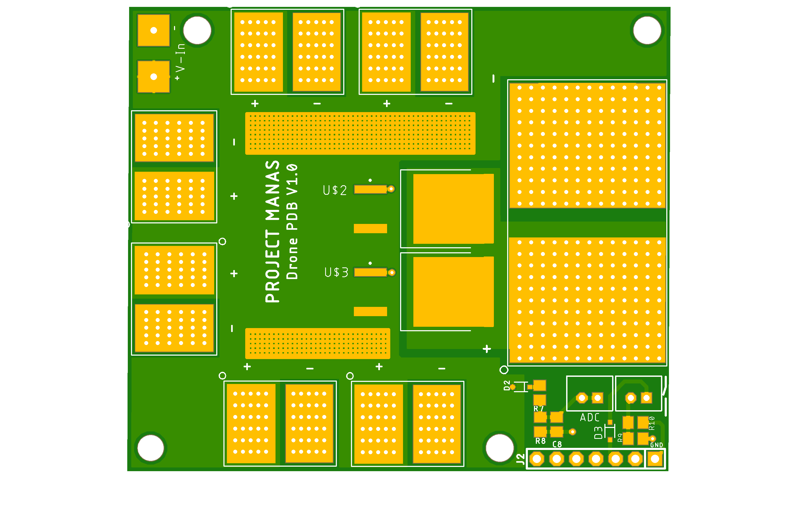
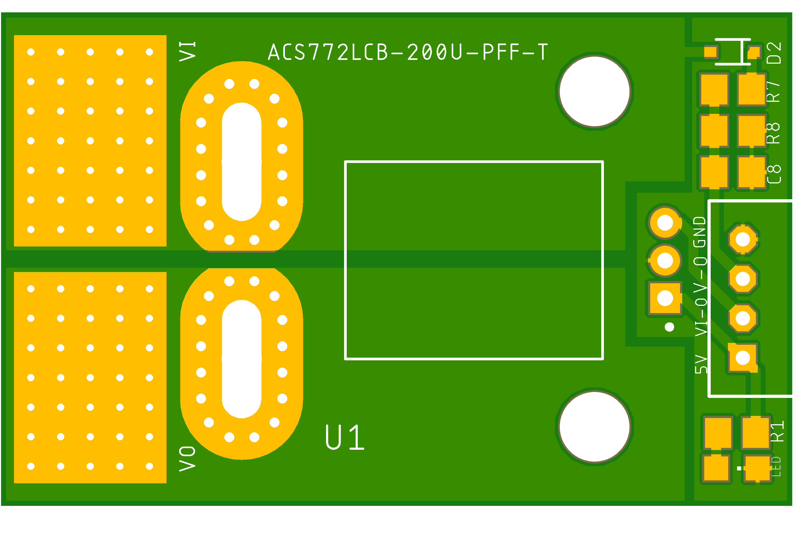
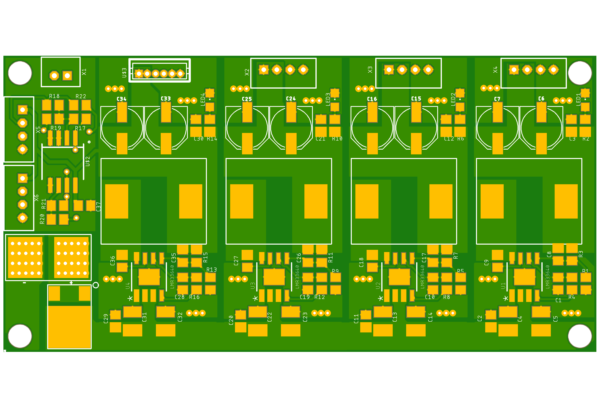

# AUVSI_Power_Distribution

This project includes the PCBS designed for the Seraphim , the Hex-rotor by PROJECT MANAS that participated in AUVSI SUAS 2022

The unavailibility of cheap and reliable power distribution systems called for designing a fully custom solution that powers the following :-
- Six T-Motor P60 170 Kv motors
- PixHawk Cube Orange
- RFD900X Telemetry Radio
- UGV Winch mechanism

The onboard electronic components are powered by
- Two 6S 32000 mAh LiPO Batteries for the Motors
- One 3S 4200 mAh LiPO Battery for control electronics

**The project includes three pcbs:**

## Power distribution pcb

A simple distributor pcb which can have upto 12 motors:
2 Oz thickness for more current
Exposed copper for heat sink
Voltage sense capability using the voltage from balance connector
Mosfets to shut down current flow when required

## Current sensing pcb  
This pcb is based on the allegro asc772 current sensor
The 400 amp variant was avoided due to unavailability
The 200 amp variant was chosen
2 boards will be used in order to measure separate packs in parallel
Output is a analog value of 5v
The board can also measure voltage levels

## Power HUB

This pcb incorporates the buck and boost modules
1x5v buck ( df13)
2x 5v buck ( ph)
1x 7.4v buck
Current sense mixer

The lmr33640 ic was chosen due to wide input range and 4 amp current output
All bucks were separated
Low space design
Can mix to current sensor values using opamp circuit
Reverse polarity protection

## Pcb design learnings from the project
- No thermals in high current pads
- Avoid choke points ( traces that make current flow path longer)
- Switching loops of power converters have to be as small as possible
- output trace thickness
- Placement of decoupling caps
- Using keepots to avoid traces being to close
- Appropriate pad sizes with vias for current conduction

All schematics , pcb images, and gerber files have been added
The gerbers were formatted for panelization
